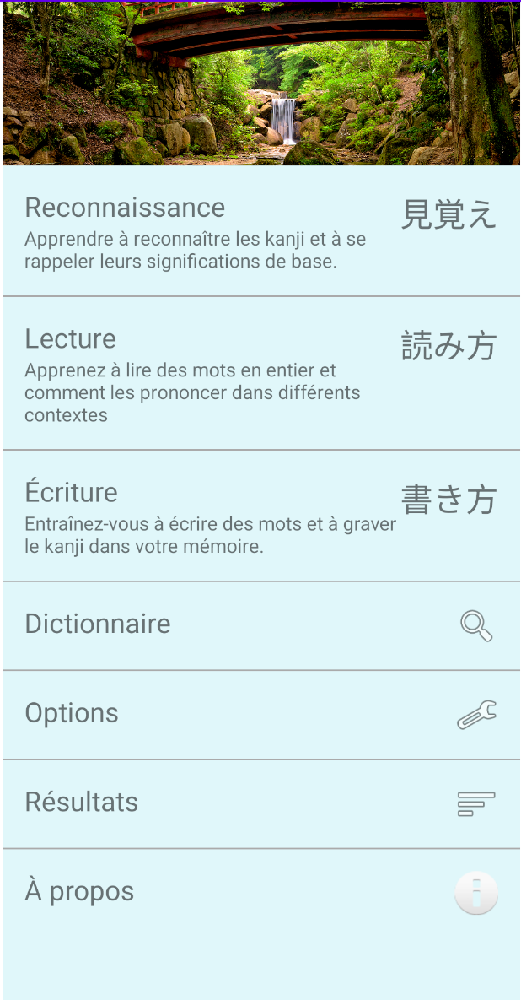
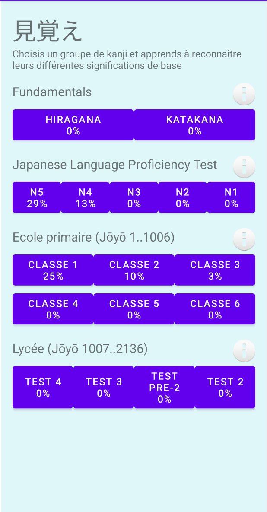
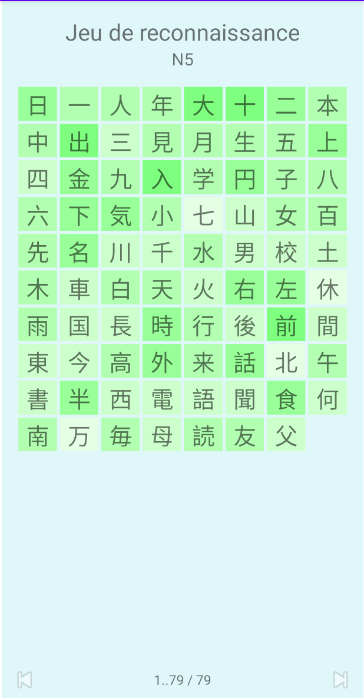
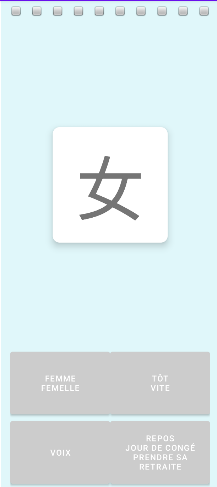
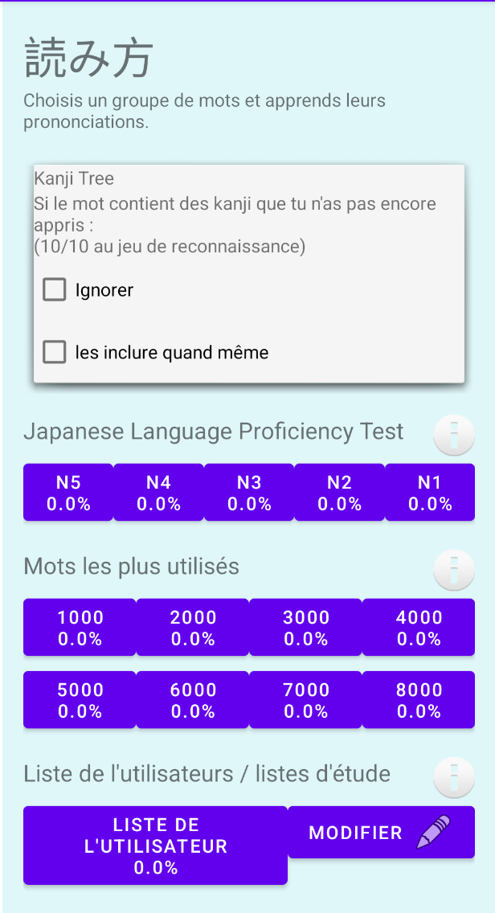
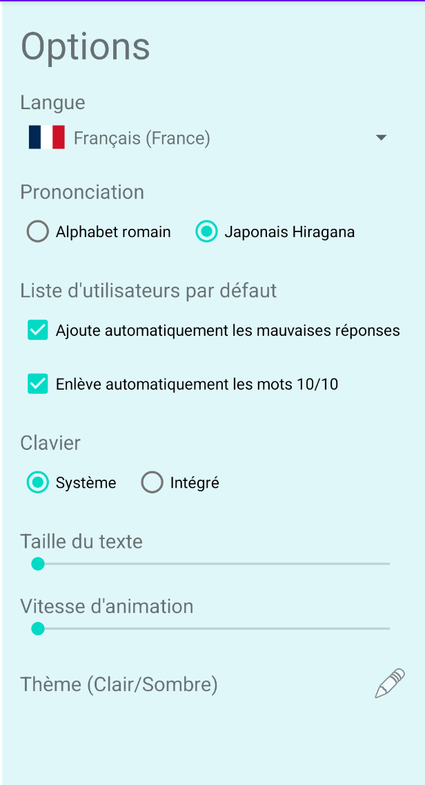

# Kanji Mori - Maîtrisez les kanjis !

Kanji Mori est une application Android conçue pour vous aider à apprendre et à maîtriser les kanjis japonais de manière ludique et efficace.

## Fonctionnalités

L'application est divisée en plusieurs sections pour vous offrir une expérience d'apprentissage complète :

### Reconnaissance

Testez votre capacité à reconnaître les kanjis. L'application vous présente un kanji et vous devez choisir la bonne signification parmi plusieurs options.

<!-- Emplacement pour la capture d'écran de la section Reconnaissance -->

### Lecture

Entraînez-vous à lire les kanjis. L'application affiche un kanji et vous devez saisir sa lecture correcte.

<!-- Emplacement pour la capture d'écran de la section Lecture -->

### Écriture

Apprenez à tracer les kanjis correctement. L'application vous guide pour écrire chaque kanji, trait par trait.

<!-- Emplacement pour la capture d'écran de la section Écriture -->

### Dictionnaire

Consultez un dictionnaire de kanjis complet. Recherchez des kanjis par leur signification, leur lecture ou leur tracé.

<!-- Emplacement pour la capture d'écran de la section Dictionnaire -->

### Paramètres

Personnalisez votre expérience d'apprentissage. Modifiez la langue, le thème, la vitesse d'animation et d'autres options.

<!-- Emplacement pour la capture d'écran de la section Paramètres -->

### Résultats

Suivez vos progrès. Consultez vos statistiques de réussite pour chaque section et identifiez les kanjis qui vous posent le plus de difficultés.

<!-- Emplacement pour la capture d'écran de la section Résultats -->

## Installation

Pour installer l'application, vous pouvez soit la télécharger depuis le Google Play Store (lien à venir), soit la compiler vous-même à partir des sources.

## Contribuer

Les contributions sont les bienvenues ! Si vous souhaitez améliorer l'application, n'hésitez pas à forker le projet et à proposer une pull request.
